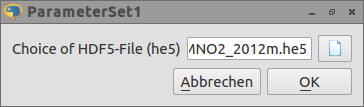
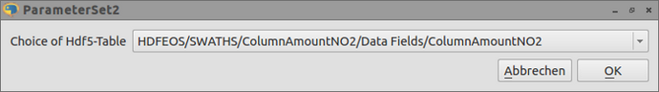
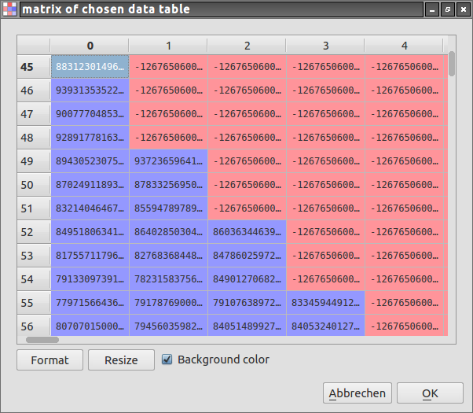

What the hell is `HDF <http://en.wikipedia.org/wiki/Hierarchical_Data_Format>`_  ? "The Hierarchical Data Format HDF (HDF4, HDF5) is the name of a set of file formats and libraries designed to store and organize large amounts of numerical data.  Originally developed at the National Center for Supercomputing Applications, it is currently supported by the non-profit HDF Group, whose mission is to ensure continued development of HDF5 technologies, and the continued accessibility of data currently stored in HDF" It is for example widely used by scientist of the NASA space agency. They are using it to save the different measured values of a telescope or a satellite. A really great database of these files is freely available on different NASA project websites. The here used HDF5 format is a little bit newer version. 3 Python packages are used for this example:

* `guidata <https://code.google.com/p/guidata/>`_
* `h5py <http://code.google.com/p/h5py/>`_
* `numpy <http://www.numpy.org/>`_

The aim of this example is to handle this kind of files with a graphical interface in a really easy (Python) way. On the end we will have a program which can open hdf5 files, can show the different hierarchical entries and can present the numerical values in matrices or vectors.

This program needs only 35 lines of code.

Guidata is a Python library generating graphical user interfaces for easy dataset editing and display.

The h5py package is a Pythonic interface to the HDF5 binary data format.

It lets you store huge amounts of numerical data, and easily manipulate that data from NumPy. For example, you can slice into multi-terabyte datasets stored on disk, as if they were real NumPy arrays. Thousands of datasets can be stored in a single file, categorized and tagged however you want.

So at first lets import the needed functions:

.. code-block:: python

    import numpy as np
    import h5py as h5
    import guidata
    from guidata.dataset.datatypes import DataSet
    from guidata.dataset.dataitems import ChoiceItem,FileOpenItem, FloatArrayItem

There is nothing special. The package numpy and h5py are imported and the used functions of the guidata package are implemented.

We need for our small application a hdf5 data file. We can get one from `here <http://mirador.gsfc.nasa.gov/cgi-bin/mirador/granlist.pl?page=1&dataSet=OMNO2&version=003&allversion=003&keyword=omno2&pointLocation=(-90,-180),(90,180)&location=(-90,-180),(90,180)&searchType=Location&event=&startTime=1945-08-10&endTime=2012-12-27%2023:59:59&search=&CGISESSID=0bb40174469c83c0783a904f95ca281f&nr=42158&temporalres=1%20Hour&prodpg=http://mirador.gsfc.nasa.gov/collections/OMNO2__003.shtml&longname=OMI/Aura%20Nitrogen%20Dioxide%20(NO2)%20Total%20and%20Tropospheric%20Column%201-orbit%20L2%20Swath%2013x24%20km&granulePresentation=ungrouped>`_, called the NASA OMI/AURA project (this NASA web database needs some time to load).

Our first mission is to open this downloaded hdf5 data file. Here is the code for that:

.. code-block:: python

    # Create QApplication
    _app = guidata.qapplication()

    class ParameterSet1(DataSet):
        fname = FileOpenItem("Choice of HDF5-File (he5)", ("he5"), "OMI-Aura_L2-OMNO2_2012m.he5")

    W1 = ParameterSet1()
    W1.edit()
    f1=h5.File(W1.fname)

The second line the initalisation for our guidata module. In line 9 and 10 there is our object for our first window. The class `ParameterSet1`
inherits from `DataSet`, a guidata object. Our first window consists of a file open dialog. So all we need for that is the call of the `FileOpenItem()` function.
The first parameter is the window title, the second is our file format of choice and the third is a default chosen file. `W1.edit()`
starts the window and the last line is opening our chosen file name with our hdf5 lib.

.. code-block:: python

    list_of_names = []
    f1.visit(list_of_names.append)
    list_of_Dataset =[]
    for name in list_of_names:
        if type(f1[name]) == h5.Dataset:
            list_of_Dataset.append(name)

A hdf5 database consists of (sub-) datasets. So we can choose our favorite numerical table. In the at last shown lines a list of all included datesets
in our file is constructed (`list_of_Dataset`). In the next window we must select one dataset:

.. code-block:: python

    class ParameterSet2(DataSet):
        Item1= ChoiceItem(u"Choice of Hdf5-Table", list_of_Dataset)

    W2 = ParameterSet2()
    W2.edit()

    dset2 = f1[list_of_Dataset[W2.Item1]]

Here you can see our next window object. It consists of a choice dialog for our list_of_Dataset. In the last line the chosen dataset (`W2.Item1`) is loaded from our hdf5 file.

.. code-block:: python

    class ParameterSet3(DataSet):
        floatarray = FloatArrayItem("matrix of chosen data table", default=np.ones( (50,5), float),
                                    format=" %.2e ")
    W3 = ParameterSet3()
    W3.floatarray=list(dset2)
    W3.edit()

... And the last window. We have here a self explaining FloatArrayItem() with an array initialisation consisting of a lot of ones.  `W3.floatarray=list(dset2)`
is setting up our chosen dataset to this window. You can see the values when you push the button.

Here again the complete code:

.. code-block:: python

    import numpy as np
    import h5py as h5
    import guidata
    from guidata.dataset.datatypes import DataSet
    from guidata.dataset.dataitems import ChoiceItem,FileOpenItem, FloatArrayItem

    # Create QApplication
    _app = guidata.qapplication()

    class ParameterSet1(DataSet):
        fname = FileOpenItem("Choice of HDF5-File (he5)", ("he5"), "OMI-Aura_L2-OMNO2_2012m.he5")

    W1 = ParameterSet1()

    W1.edit()
    f1=h5.File(W1.fname)

    list_of_names = []
    f1.visit(list_of_names.append)
    list_of_Dataset =[]
    for name in list_of_names:
        if type(f1[name]) == h5.Dataset:
            list_of_Dataset.append(name)
    class ParameterSet2(DataSet):
        Item1= ChoiceItem(u"Choice of Hdf5-Table", list_of_Dataset)

    W2 = ParameterSet2()
    W2.edit()

    dset2 = f1[list_of_Dataset[W2.Item1]]

    class ParameterSet3(DataSet):
        floatarray = FloatArrayItem("matrix of chosen data table", default=np.ones( (50,5), float),
                                    format=" %.2e ")
    W3 = ParameterSet3()
    W3.floatarray=list(dset2)
    W3.edit()

C U!