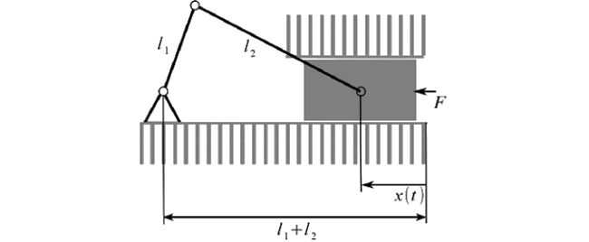
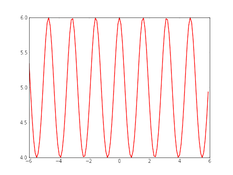

.. _intronumpy:

****************************************************
-Python Packages- Part 1: Numpy and Matplotlib
****************************************************

Python is a fantastic programming tool. It has a simple syntax, a lot of additional libraries and this scripts are running out of the box. 
All you need is an installed Python interpreter and the used libraries. It runs under MS Windows, Mac, Linux and other. The scripting language
is like the glue between different components and other programming languages. For example you can call C/C++ functions with Cython inside Python scripts. 

Python claims to combine "remarkable power with very clear syntax" `[Python-docs] <http://docs.python.org/2/tutorial/index.html>`_  

In this blog I want to show you some important tools and libraries. This is the first part of this topic. Here is is a introduction by example in the 2 packages.

*  Numpy
*  Matplotlib

Calculation examples with visualization you can find in the project part ( project 1 and 2) .

Numpy
=======

`Numpy <http://www.numpy.org>`_  is an extension to Python. It has the following features:

 *   Support for multidimensional arrays and matrices,
 *   A wide range of functions for calculations

Here is a very short example to demonstrate the might of numpy. It is from the introduction in the numpy userguide `[numpy-docs] <http://docs.scipy.org/doc/numpy/user/whatisnumpy.html>`_ .

In C/C++ a multiplication of 2 2D matrices is done in this way:

.. code-block:: cpp

	for (i = 0; i < rows; i++): {
  		for (j = 0; j < columns; j++): {
    			c[i][j] = a[i][j]*b[i][j];
  		}
	}

You can see 2 for-loops where in each step one element is calculated. And here is the version in Python with Numpy:

.. code-block:: python

	c=a*b

It is nearly so fast as the C/C++ implementation, because Numpy calls internally C/C++ functions. So, Python is like an interface to C/C++ to make the live for engineers easier.

Matplotlib
==========

`Matplotlib <http://matplotlib.org>`_   is a python 2D and 3D plotting library which you can directly implement in your python programs. In the backside of this Web application it is also implemented.

"You can generate plots, histograms, power spectra, bar charts, errorcharts, scatterplots, etc, with just a few lines of code. " [matplotlib]

**1. Example**

In the the figure you can see a model of a crankshaft. The aim is here to calculate the velocity of x(t). In formula 1 you can see the used calculation. 

.. math::

	l_{2}^{2}=l_{1}^{2}+x^{2}-2l_{1}x\cos\varphi

	\lambda=\frac{l_{1}}{l_{2}}

	x=l_{2}(\lambda\cos\varphi+\sqrt{1-\lambda^{2}\sin^{2}\varphi})

	(1) ~~~~~~ v(t)=\dot{x}(t)=-\lambda l_{2}\omega\sin(\omega t)\left(1+\frac{\lambda\cos(\omega t)}{\sqrt{1-\lambda^{2}\sin^{2}(\omega t)}}\right)
	
	l_1 = 1, ~l_2=5,~ \omega= 4

To calculate it in Python, you can do the following steps:

.. code-block:: python

	import matplotlib.pyplot as pp
	import numpy as np

	def k(t,lam, omega,l_1,l_2):
       		return l_2*(lam*np.cos(omega*t)+np.sqrt(1-(lam*lam*np.sin(omega*t)*np.sin(omega*t))))

	l_1=1.0
	l_2=5.0
	omega = 4.0
	lam = l_1 / l_2
	t = np.arange(-6, 6, 0.1)
	S = k(t,lam, omega,l_1,l_2)
	pp.plot(t, S, color='red', lw=2)
	pp.savefig("plot.png",dpi=60)

In line 1 and 2 are the 2 necessary packages implemented. Matplotlib supports a lot of plotting functions (line 13-15), while Numpy is used for the array, which is generated in line 11. In line 13 is the time frame for the plot . The range is from -6 to 6 seconds with a step size of 0.1 seconds. the pp.plot() function is the the Matplot call to generate the plot. The first parameter is the time-array (x-Axes). The second parameter is the function to plot (y-Axes), in our case formula (1). With pp.savefig the plot is saved in a file.

Here is the output of the plot:

**2. Example**

Here is an example of a solver for linear matrix equations. In the figure you can see the circuit to be analyzed.

.. math::
	\begin{array}{c}(I)\\(II)\\(III)\end{array}\left[\begin{array}{ccc}0 & -R_{2} & R_{4}+R_{5}\\R_{3}+R_{1} & R_{2} & 0\\1 & -1 & 1\end{array}\right]\cdot\left[\begin{array}{c}I_{1}\\I_{2}\\I_{3}\end{array}\right]=\left[\begin{array}{c}U_{q1}\\U_{q2}\\0\end{array}\right]

And here the code to solve this problem to get the current. 

.. code-block:: python

    import matplotlib.pyplot as pp
    import numpy as np

    #Some example values
    R_1=100;R_2=200;R_3=300;R_4=400;R_5=500
    I_1=0.0;I_2=0.0;I_3=0.0
    U_q1=50.0; U_q2=50.0

    #definition of the arrayhttps://bitbucket.org/MajorTom3001/project3001_org
    R_mat = np.array([[1.,  -1., -1.],[0.,  -R_2,  R_4+R_5],[R_3+R_1,  R_2, 0]])
    U_mat = np.array([0,U_q1,U_q2])

    #numeric solution of the current
    I_mat = np.linalg.solve(R_mat,U_mat)

    print I_mat

In line 10 the matrices for the resistor and in  line 11 the matrices for the voltage is generated. In line 16 the formula is solved to get the variables (in this case the current).

The output is:

[ 0.10483871  0.04032258  0.06451613]

Here you can find a great `numpy/scipy cookbook <http://wiki.scipy.org/Cookbookl>`_.

And here is a great list of `matplotlib examples <http://matplotlib.org/examples/>`_.
