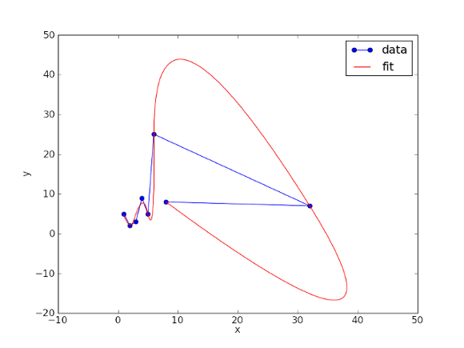

.. _introscipy:

****************************************************
-Python Packages- Part 2: Scipy
****************************************************

In this part I want to write something about Scipy. It is an extension for Numpy.

`SciPy <http://www.scipy.org>`_ contains modules for optimization, linear algebra, integration, interpolation, special
functions, FFT, signal and image processing, ODE solvers and others.

Here I want to show you an example with B-splines. It is a subfield of numerical analysis. It has a
wide range of applications like in the computer science subfields computer-aided design and
computer graphics. It is also used for motion planning of robots and other mechanic structures.
B-splines were investigated in the beginning of the last century by Nikolai Lobachevsky. In the
mathematics, a spline is a smooth polynomial function that is piecewise-defined, and possesses
a high degree of smoothness at the places where the polynomial pieces connect (which are
known as knots).
B-splines can be evaluated in a numerically stable way by the `de Boor algorithm <http://en.wikipedia.org/wiki/De_Boor_algorithm>`_  .
I don’t want to confuse you here with this stuff of mathematical derivations. If you are more interested in this,
you can read detailed information about computed geometry `here <http://www.cs.mtu.edu/~shene/COURSES/cs3621/NOTES/>`_  .
The details of the deviations are also not my interest.

In Scipy is a function implemented to solve these problems for you. See the example below.

.. code-block:: python
    :linenos:

    import matplotlib.pyplot as pp
    import numpy as np
    from scipy.interpolate import splprep, splev
    Px = [1.0,2.0,3.0,4.0,5.0,6.0,32.0,8.0,9.0]
    Py = [5.0,2.0,3.0,9.0,5.0,25.0,7.0,8.0,20.0]
    #generating of the b-spline
    tckp,u = splprep([Px,Py],s=3,k=2,nest=-1)
    # evaluating (x-y-representation) of the b-spline
    Pxnew,Pynew = splev(np.linspace(0,1,200),tckp)
    data,=pp.plot(Px,Py,'bo-',label='data')
    fit,=pp.plot(Pxnew,Pynew,'r-',label='fit')
    pp.legend()
    pp.xlabel('x')
    pp.ylabel('y')
    pp.savefig('splprep.png')
    pp.figure()

In line 1 is imported the package to plot the spline curve. In line 2 is imported the Numpy package for some array
functions and in `scipy.interpolate` are the necessary b-spline packages. In line 7 the `splprep` function finds the
B-spline representation of a curve. The factor `k` is the degree of the spline, while s is a smoothing condition which
is here of lower importance then the `k` factor. The `tckp` return value is a sequence of length 3 returned by `splrep` which
contains the knots, coefficients, and degree of the B-spline.

In line 9 the `splev` function is evaluating the B-spline. The linspace function, which is given as an argument,
creates an 1-diminsional array with 200 values between 0 and 1. It is the given resolution for the created B-spline curve.
This is one reason why the smoothness value s is of lower interest in this example.

The last lines are for plotting and legend configuration of the plot.
The first plot command draws the points, the second command draws the B-spline.

`Here <http://wiki.scipy.org/>`_  is a link to the scipy api.

Here is the result of this algorithm:

`Here <http://wiki.scipy.org/Cookbook/Interpolation>`_  you can find some interpolation examples with scipy.
