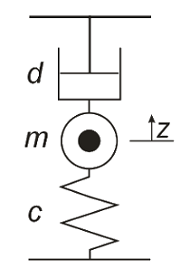
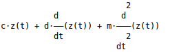
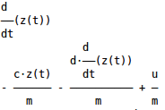
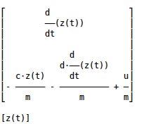

.. _introsympy:

****************************************************
-Python Packages- Part 3: Sympy 
****************************************************

`SymPy <http://sympy.org/en/index.html>`_ is a library for symbolic computation for (you are right...) Python.

It includes features like basic symbolic arithmetic, calculus, algebra and discrete mathematics.To show you a small example, 
I used a classical linear system of an one-dimensional movement of a mass  described with the Newton’s laws of motion which is 
moving vertical between 2 walls, a spring and a damper.

Here is the equation in case of the balanced state (no more influence of the weight) :

.. math::
	m\cdot\ddot{z}(t)+d\cdot\dot{z}(t)+c\cdot z(t)=F(t) 

F(t) is an external force.

So, we need the following first steps in Sympy:

.. code-block:: python

	#Import of the necessary functions from the sympy module
	from sympy import symbols, pprint, Function, Matrix
	#Definition of the system variables and functions as symbols
	d, c, m , t,  u = symbols("d c m t u")
	F = Function('F')
	z = Function('z')
	#Definition of the equation
	F= m* z(t).diff(t, t) + d*z(t).diff(t) + c*z(t)
	#pretty-print python function for data structures
	pprint( F,  use_unicode= True)

In the first line you can see the import of the necessary functions. In the next 3 lines, the different symbols for our calculation are defined. Now you are able to make different operations like integration or derivation of your functions without loosing the meaning of your different parameters and symbols.

With the definition in line 8 you are setting your equation of the movement. With the .diff(t)  statement you are building the derivation of z(t). Further, .diff(t,t) is the second derivation.

In the last line you are printing out your solution of this equation in a more beautiful way (use_unicode=True):

So lets go further to write down the state equation to calculate the state space representation of our system:

.. math::

	\ddot{z}(t)+\frac{d}{m}\dot{z}(t)+\frac{c}{m}z(t)=\frac{1}{m}F(t)

Elements of the system matrix:

.. math::

	a_{1}=\frac{d}{m};a_{0}=\frac{c}{m};b_{0}=\frac{1}{m}

State vector:

.. math::

	x_{1}(t)=z(t);x_{2}=\dot{z}(t)

Input variable (external force):

.. math::

	u(t)=F(t)

Derivation of the state vector:

.. math::

	\dot{x}_{1}(t)=x_{2}(t)

	\dot{x}_{2}(t)=-a_{0}x_{1}(t)-a_{1}x_{2}(t)+b_{0}u(t)

So far, here the equivalent additional Python-Code with Sympy:

.. code-block:: python

	a_1 = d/m
	a_0 = c/m
	b_0 = 1/m

	x_1 = z(t)
	x_2 = z(t).diff(t)

	d_x_1 = x_2
	d_x_2 = - a_0 *x_1 - a_1*x_2 + b_0 * u

	pprint(d_x_1,  use_unicode= True)
	pprint(d_x_2,  use_unicode= True)

Terminal output of the last added Python lines:

System output:

.. math::

	y(t)=x_{1}(t)=z(t)

State space representation:

.. math::

	\boldsymbol{\dot{x}}(t)=\boldsymbol{Ax}(t)+\boldsymbol{b}u(t)

Output equation:

.. math::

	y(t)=\boldsymbol{c}^{T}\boldsymbol{x}(t)

State space in detail:

.. math::

	\left[\begin{array}{c} \dot{x}_{1}(t)\\ \dot{x}_{2}(t) \end{array}\right]=\left[\begin{array}{cc} 0 & 1\\ -a_{0} & -a_{1} \end{array}\right]\cdot\left[\begin{array}{c} x_{1}(t)\\ x_{2}(t) \end{array}\right]+\left[\begin{array}{c} 0\\ b_{0} \end{array}\right]\cdot u(t)

And here the Python code of the state space with the special Matrix() Sympy function:

.. code-block:: python

	d_X= Matrix([[0,1], [-a_0,-a_1]])*Matrix([x_1,x_2]) + Matrix([0,b_0]) *u
	pprint( d_X,  use_unicode= True)
	Y = Matrix([1,0]).H*Matrix([x_1,x_2])
	pprint( Y,  use_unicode= True)

Last but not least the terminal output of this last 2 pprint functions:

So, I think that is enough for today, C U!